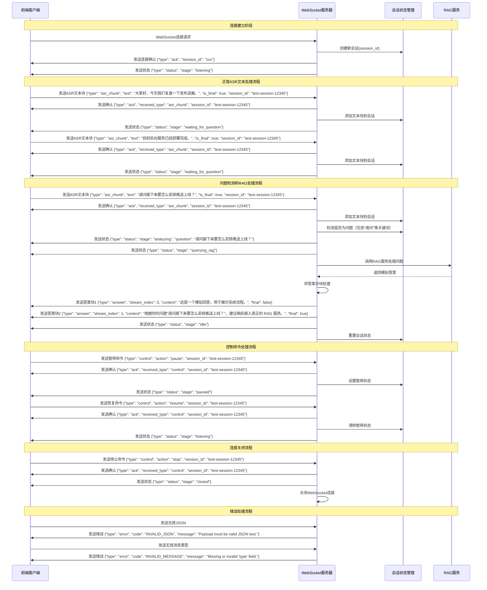

# 实时RAG系统前后端交互时序图

## 系统架构概述

本系统是一个基于WebSocket的实时RAG（检索增强生成）原型，包含以下主要组件：
- **前端客户端**：发送ASR（自动语音识别）文本块
- **WebSocket服务器**：处理实时通信和会话管理
- **RAG服务**：模拟的检索增强生成服务

## 时序图



## 消息类型说明

### 客户端发送的消息类型

1. **asr_chunk**: ASR文本块
   ```json
   {
     "type": "asr_chunk",
     "text": "文本内容",
     "is_final": true/false,
     "timestamp": 1234567890,
     "session_id": "用户会话ID（可选）"
   }
   ```

2. **control**: 控制命令
   ```json
   {
     "type": "control",
     "action": "pause|resume|stop",
     "session_id": "用户会话ID（可选）"
   }
   ```

3. **keepalive**: 保活消息
   ```json
   {
     "type": "keepalive",
     "session_id": "用户会话ID（可选）"
   }
   ```

### 服务器发送的消息类型

1. **ack**: 确认消息
   ```json
   {
     "type": "ack",
     "received_type": "消息类型",
     "session_id": "会话ID"
   }
   ```

2. **status**: 状态消息
   ```json
   {
     "type": "status",
     "stage": "listening|paused|analyzing|querying_rag|idle|closed",
     "question": "问题内容（可选）",
     "note": "备注信息（可选）"
   }
   ```

3. **answer**: 答案消息
   ```json
   {
     "type": "answer",
     "stream_index": 0,
     "content": "答案内容",
     "final": true/false
   }
   ```

4. **error**: 错误消息
   ```json
   {
     "type": "error",
     "code": "错误代码",
     "message": "错误描述"
   }
   ```

## 关键特性

1. **实时流式处理**: 支持ASR文本的实时流式输入和处理
2. **会话状态管理**: 每个连接维护独立的会话状态
3. **用户身份识别**: 支持客户端发送session_id来区分用户身份
4. **问题检测**: 基于关键词和标点符号的简单问题检测机制
5. **流式答案**: RAG答案分块流式返回
6. **控制命令**: 支持暂停、恢复、停止等控制操作
7. **错误处理**: 完善的错误处理和反馈机制

## Session ID 功能说明

### 功能描述
- 客户端可以在发送的JSON消息中包含`session_id`字段来标识用户身份
- 如果客户端提供了`session_id`，服务器会使用该ID来管理会话状态
- 如果客户端没有提供`session_id`，服务器会生成一个随机的UUID作为会话ID
- 支持在连接过程中动态切换session_id

### 使用场景
1. **多用户支持**: 同一个WebSocket连接可以处理多个用户的会话
2. **会话恢复**: 客户端可以指定特定的session_id来恢复之前的会话状态
3. **用户隔离**: 不同用户的会话状态完全隔离，互不影响

### 实现细节
- 服务器在接收到包含不同session_id的消息时，会创建新的SessionState实例
- 所有消息类型（asr_chunk、control、keepalive）都支持session_id字段
- session_id字段为可选字段，向后兼容现有客户端

