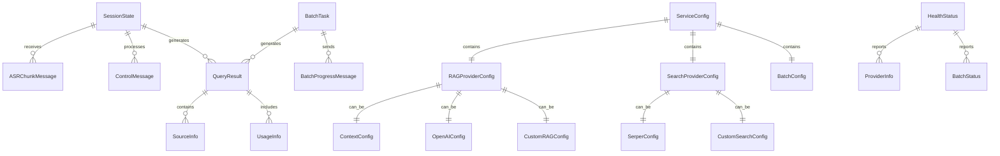

# 数据模型

## 概述

本文档定义了 Realtime RAG WebSocket 服务中使用的核心数据模型，包括会话状态、消息格式、查询结果、批量处理任务和配置数据结构。系统支持两种处理模式：实时流式处理和离线批量处理。

## 核心数据实体

### 1. SessionState (会话状态)

会话状态管理用户连接的完整状态信息。

```python
class SessionState:
    """会话状态数据模型"""
    
    def __init__(self, session_id: str):
        self.session_id: str = session_id                    # 会话唯一标识
        self.final_chunks: List[str] = []                   # 最终化 ASR 文本块列表
        self.is_paused: bool = False                        # 是否暂停状态
        self.last_final_text: Optional[str] = None          # 最后一个最终化文本
        self.current_query_task: Optional[Task] = None      # 当前查询任务
```

#### 属性说明

| 属性 | 类型 | 描述 | 约束 |
|------|------|------|------|
| `session_id` | `str` | 会话唯一标识符 | 非空，UUID 格式 |
| `final_chunks` | `List[str]` | 最终化 ASR 文本块列表 | 按时间顺序存储 |
| `is_paused` | `bool` | 会话是否处于暂停状态 | 默认 False |
| `last_final_text` | `Optional[str]` | 最后一个最终化的文本 | 可为空 |
| `current_query_task` | `Optional[Task]` | 当前正在执行的查询任务 | 可为空 |

#### 方法说明

```python
def add_chunk(self, text: str, is_final: bool) -> None:
    """添加 ASR 文本块"""
    
@property
def aggregated_text(self) -> str:
    """获取聚合后的文本"""
    
@property
def has_active_query(self) -> bool:
    """检查是否有活跃的查询任务"""
    
def reset(self) -> None:
    """重置会话状态"""
    
def looks_like_question(self) -> bool:
    """判断文本是否像问题"""
```

### 2. BatchTask (批量处理任务)

批量处理任务的数据模型，用于管理离线批量处理任务。

```python
@dataclass
class BatchTask:
    """批量处理任务数据模型"""
    
    task_id: str                                    # 任务唯一标识
    name: str                                       # 任务名称
    description: Optional[str] = None               # 任务描述
    texts: List[str]                               # 待处理文本列表
    options: Dict[str, Any]                        # 处理选项
    status: str                                    # 任务状态
    progress: Dict[str, int]                       # 进度信息
    results: Optional[List[Dict[str, Any]]] = None # 处理结果
    created_at: datetime                           # 创建时间
    started_at: Optional[datetime] = None         # 开始时间
    completed_at: Optional[datetime] = None        # 完成时间
    error_message: Optional[str] = None           # 错误信息
```

#### 属性说明

| 属性 | 类型 | 描述 | 约束 |
|------|------|------|------|
| `task_id` | `str` | 任务唯一标识符 | 非空，UUID 格式 |
| `name` | `str` | 任务名称 | 非空，最大长度 100 |
| `description` | `Optional[str]` | 任务描述 | 最大长度 500 |
| `texts` | `List[str]` | 待处理文本列表 | 非空，最多 10000 项 |
| `options` | `Dict[str, Any]` | 处理选项 | 包含提供商、并发数等 |
| `status` | `str` | 任务状态 | pending, processing, completed, failed, cancelled |
| `progress` | `Dict[str, int]` | 进度信息 | 包含总数、已完成、失败数 |
| `results` | `Optional[List[Dict]]` | 处理结果 | 每个文本的处理结果 |
| `created_at` | `datetime` | 创建时间 | 非空 |
| `started_at` | `Optional[datetime]` | 开始时间 | 可为空 |
| `completed_at` | `Optional[datetime]` | 完成时间 | 可为空 |
| `error_message` | `Optional[str]` | 错误信息 | 可为空 |

### 3. QueryResult (查询结果)

统一的查询结果数据格式，用于标准化不同提供商的返回结果。

```python
@dataclass
class QueryResult:
    """查询结果数据模型"""
    
    content: str                                    # 主要回答内容
    metadata: Optional[Dict[str, Any]] = None      # 元数据信息
    sources: Optional[List[Dict[str, Any]]] = None # 来源信息列表
    usage: Optional[Dict[str, Any]] = None         # 使用统计信息
```

#### 属性说明

| 属性 | 类型 | 描述 | 示例 |
|------|------|------|------|
| `content` | `str` | 主要回答内容 | "人工智能是计算机科学的一个分支..." |
| `metadata` | `Optional[Dict]` | 元数据信息 | `{"provider": "context", "model": "gpt-4"}` |
| `sources` | `Optional[List[Dict]]` | 来源信息列表 | `[{"title": "文档标题", "url": "链接"}]` |
| `usage` | `Optional[Dict]` | 使用统计信息 | `{"tokens": 150, "cost": 0.001}` |

#### 示例数据

```json
{
  "content": "人工智能（AI）是计算机科学的一个分支，致力于创建能够执行通常需要人类智能的任务的系统。",
  "metadata": {
    "provider": "context",
    "model": "gpt-4",
    "processing_time": 1.2,
    "confidence": 0.95
  },
  "sources": [
    {
      "title": "人工智能基础概念",
      "url": "https://example.com/ai-basics",
      "relevance": 0.9,
      "snippet": "人工智能的定义和应用..."
    }
  ],
  "usage": {
    "input_tokens": 50,
    "output_tokens": 100,
    "total_tokens": 150,
    "cost": 0.001,
    "currency": "USD"
  }
}
```

### 3. WebSocket 消息格式

WebSocket 通信中使用的标准化消息格式。

#### 客户端消息格式

##### ASR 文本块消息
```python
@dataclass
class ASRChunkMessage:
    """ASR 文本块消息"""
    
    type: str = "asr_chunk"                          # 消息类型
    text: str                                        # ASR 识别的文本
    is_final: bool                                   # 是否为最终结果
    session_id: Optional[str] = None                 # 会话标识（可选）
    timestamp: Optional[int] = None                  # 时间戳（可选）
```

##### 控制消息
```python
@dataclass
class ControlMessage:
    """控制消息"""
    
    type: str = "control"                            # 消息类型
    action: str                                      # 控制动作
    session_id: Optional[str] = None                 # 会话标识（可选）
```

支持的控制动作：
- `pause`: 暂停处理
- `resume`: 恢复处理
- `stop`: 停止会话
- `instant_query`: 即时查询

##### 心跳消息
```python
@dataclass
class KeepAliveMessage:
    """心跳消息"""
    
    type: str = "keepalive"                          # 消息类型
    session_id: Optional[str] = None                 # 会话标识（可选）
```

#### 服务器消息格式

##### 确认消息
```python
@dataclass
class AckMessage:
    """确认消息"""
    
    type: str = "ack"                                # 消息类型
    message: Optional[str] = None                    # 确认消息
    received_type: Optional[str] = None              # 接收到的消息类型
    session_id: str                                  # 会话标识
```

##### 状态消息
```python
@dataclass
class StatusMessage:
    """状态消息"""
    
    type: str = "status"                             # 消息类型
    stage: str                                       # 当前阶段
    session_id: str                                  # 会话标识
    note: Optional[str] = None                       # 备注信息
    question: Optional[str] = None                   # 当前问题
    mode: Optional[str] = None                       # 查询模式
```

支持的状态阶段：
- `listening`: 监听中
- `paused`: 已暂停
- `waiting_for_question`: 等待问题
- `analyzing`: 分析中
- `instant_query`: 即时查询
- `querying_rag`: 查询 RAG 服务
- `interrupting`: 中断中
- `idle`: 空闲
- `closed`: 已关闭

##### 答案消息
```python
@dataclass
class AnswerMessage:
    """答案消息"""
    
    type: str = "answer"                             # 消息类型
    stream_index: int                                # 流索引
    content: str                                     # 答案内容
    final: bool                                      # 是否为最后一块
    session_id: str                                  # 会话标识
```

##### 批量处理进度消息
```python
@dataclass
class BatchProgressMessage:
    """批量处理进度消息"""
    
    type: str = "batch_progress"                     # 消息类型
    task_id: str                                     # 任务标识
    progress: Dict[str, int]                         # 进度信息
    status: str                                      # 任务状态
    session_id: str                                  # 会话标识
    estimated_completion: Optional[str] = None       # 预计完成时间
```

##### 错误消息
```python
@dataclass
class ErrorMessage:
    """错误消息"""
    
    type: str = "error"                              # 消息类型
    code: str                                        # 错误代码
    message: str                                     # 错误描述
    session_id: str                                  # 会话标识
    details: Optional[Dict[str, Any]] = None         # 错误详情
```

支持的错误代码：
- `INVALID_JSON`: JSON 格式错误
- `INVALID_MESSAGE`: 消息格式错误
- `UNSUPPORTED_TYPE`: 不支持的消息类型
- `UNKNOWN_ACTION`: 未知的控制动作
- `NO_FINAL_ASR`: 没有可用的最终化 ASR 文本
- `EMPTY_QUESTION`: 问题内容为空
- `SERVER_ERROR`: 服务器内部错误
- `SERVICE_UNAVAILABLE`: 服务不可用
- `RAG_ERROR`: RAG 服务错误
- `BATCH_TASK_NOT_FOUND`: 批量任务不存在
- `BATCH_TASK_FAILED`: 批量任务处理失败
- `BATCH_QUEUE_FULL`: 批量任务队列已满

### 4. 配置数据模型

#### 服务配置
```python
@dataclass
class ServiceConfig:
    """服务配置数据模型"""
    
    rag: Dict[str, Any]                              # RAG 服务配置
    search: Dict[str, Any]                           # 搜索服务配置
    batch: Dict[str, Any]                            # 批量处理配置
```

#### 批量处理配置
```python
@dataclass
class BatchConfig:
    """批量处理配置数据模型"""
    
    enabled: bool                                    # 是否启用批量处理
    max_concurrent: int                              # 最大并发处理数
    queue_type: str                                  # 队列类型
    storage_path: str                                # 结果存储路径
    max_queue_size: int                              # 最大队列大小
    task_timeout: int                                # 任务超时时间（秒）
    retry_attempts: int                               # 重试次数
    retry_delay: int                                 # 重试延迟（秒）
```

#### RAG 提供商配置
```python
@dataclass
class RAGProviderConfig:
    """RAG 提供商配置"""
    
    provider: str                                    # 提供商名称
    config: Dict[str, Any]                           # 提供商特定配置
```

#### Context Provider 配置
```python
@dataclass
class ContextConfig:
    """Context Provider 提供商配置"""
    
    api_key: str                                     # API 密钥
    base_url: str                                    # 基础 URL
    timeout: float                                   # 超时时间（秒）
```

#### Serper 配置
```python
@dataclass
class SerperConfig:
    """Serper 提供商配置"""
    
    api_key: str                                     # API 密钥
    timeout: float                                   # 超时时间（秒）
```

### 5. 健康检查数据模型

#### 健康状态
```python
@dataclass
class HealthStatus:
    """健康状态数据模型"""
    
    status: str                                      # 总体状态
    version: str                                     # 应用版本
    services: Dict[str, bool]                        # 服务状态
    providers: Dict[str, Dict[str, Any]]             # 提供商信息
    timestamp: str                                   # 检查时间戳
```

#### 提供商信息
```python
@dataclass
class ProviderInfo:
    """提供商信息数据模型"""
    
    name: str                                        # 提供商名称
    type: str                                        # 提供商类型（RAG/Search）
    status: bool                                     # 是否可用
    config: Optional[Dict[str, Any]] = None          # 配置信息
```

## 数据关系图



## 数据验证规则

### 会话状态验证

```python
def validate_session_state(session: SessionState) -> bool:
    """验证会话状态数据"""
    
    # 会话 ID 验证
    if not session.session_id or len(session.session_id) == 0:
        return False
    
    # 文本块验证
    for chunk in session.final_chunks:
        if not isinstance(chunk, str) or len(chunk.strip()) == 0:
            return False
    
    # 暂停状态验证
    if not isinstance(session.is_paused, bool):
        return False
    
    return True
```

### 批量处理任务验证

```python
def validate_batch_task(task: BatchTask) -> bool:
    """验证批量处理任务数据"""
    
    # 任务 ID 验证
    if not task.task_id or len(task.task_id) == 0:
        return False
    
    # 任务名称验证
    if not task.name or len(task.name) > 100:
        return False
    
    # 文本列表验证
    if not task.texts or len(task.texts) == 0 or len(task.texts) > 10000:
        return False
    
    # 状态验证
    valid_statuses = ["pending", "processing", "completed", "failed", "cancelled"]
    if task.status not in valid_statuses:
        return False
    
    # 进度信息验证
    if not isinstance(task.progress, dict):
        return False
    
    required_progress_fields = ["total", "completed", "failed"]
    for field in required_progress_fields:
        if field not in task.progress or not isinstance(task.progress[field], int):
            return False
    
    return True
```

### 查询结果验证

```python
def validate_query_result(result: QueryResult) -> bool:
    """验证查询结果数据"""
    
    # 内容验证
    if not result.content or len(result.content.strip()) == 0:
        return False
    
    # 元数据验证
    if result.metadata and not isinstance(result.metadata, dict):
        return False
    
    # 来源验证
    if result.sources:
        for source in result.sources:
            if not isinstance(source, dict):
                return False
            if not source.get("title") or not source.get("url"):
                return False
    
    return True
```

### 消息格式验证

```python
def validate_websocket_message(message: Dict[str, Any]) -> bool:
    """验证 WebSocket 消息格式"""
    
    # 必需字段验证
    if "type" not in message:
        return False
    
    message_type = message["type"]
    
    # 根据消息类型验证字段
    if message_type == "asr_chunk":
        required_fields = ["text", "is_final"]
        for field in required_fields:
            if field not in message:
                return False
    
    elif message_type == "control":
        if "action" not in message:
            return False
    
    return True
```

## 数据持久化

### 内存存储

当前实现使用内存存储会话状态，适合无状态部署：

```python
# 会话状态存储在内存中
sessions: Dict[str, SessionState] = {}

# 优点：快速访问，无外部依赖
# 缺点：重启后数据丢失，不支持集群部署
```

### 未来扩展：持久化存储

#### Redis 存储
```python
# 使用 Redis 存储会话状态和批量任务
import redis
import json

redis_client = redis.Redis(host='localhost', port=6379, db=0)

def save_session(session: SessionState) -> None:
    """保存会话状态到 Redis"""
    key = f"session:{session.session_id}"
    data = {
        "session_id": session.session_id,
        "final_chunks": json.dumps(session.final_chunks),
        "is_paused": str(session.is_paused),
        "last_final_text": session.last_final_text or ""
    }
    redis_client.hset(key, mapping=data)
    redis_client.expire(key, 3600)  # 1小时过期

def save_batch_task(task: BatchTask) -> None:
    """保存批量处理任务到 Redis"""
    key = f"batch_task:{task.task_id}"
    data = {
        "task_id": task.task_id,
        "name": task.name,
        "description": task.description or "",
        "texts": json.dumps(task.texts),
        "options": json.dumps(task.options),
        "status": task.status,
        "progress": json.dumps(task.progress),
        "created_at": task.created_at.isoformat(),
        "started_at": task.started_at.isoformat() if task.started_at else "",
        "completed_at": task.completed_at.isoformat() if task.completed_at else "",
        "error_message": task.error_message or ""
    }
    redis_client.hset(key, mapping=data)
    redis_client.expire(key, 86400 * 7)  # 7天过期

def load_batch_task(task_id: str) -> Optional[BatchTask]:
    """从 Redis 加载批量处理任务"""
    key = f"batch_task:{task_id}"
    data = redis_client.hgetall(key)
    if not data:
        return None
    
    task = BatchTask(
        task_id=data["task_id"],
        name=data["name"],
        description=data["description"] or None,
        texts=json.loads(data["texts"]),
        options=json.loads(data["options"]),
        status=data["status"],
        progress=json.loads(data["progress"]),
        created_at=datetime.fromisoformat(data["created_at"]),
        started_at=datetime.fromisoformat(data["started_at"]) if data["started_at"] else None,
        completed_at=datetime.fromisoformat(data["completed_at"]) if data["completed_at"] else None,
        error_message=data["error_message"] or None
    )
    
    return task
```

#### 数据库存储
```python
# 使用 SQLAlchemy 存储会话状态和批量任务
from sqlalchemy import Column, String, Boolean, Text, DateTime, Integer, JSON
from sqlalchemy.ext.declarative import declarative_base

Base = declarative_base()

class SessionModel(Base):
    """会话状态数据库模型"""
    
    __tablename__ = "sessions"
    
    session_id = Column(String(255), primary_key=True)
    final_chunks = Column(Text)  # JSON 字符串
    is_paused = Column(Boolean, default=False)
    last_final_text = Column(Text)
    created_at = Column(DateTime)
    updated_at = Column(DateTime)

class BatchTaskModel(Base):
    """批量处理任务数据库模型"""
    
    __tablename__ = "batch_tasks"
    
    task_id = Column(String(255), primary_key=True)
    name = Column(String(100), nullable=False)
    description = Column(Text)
    texts = Column(Text)  # JSON 字符串
    options = Column(JSON)
    status = Column(String(50), nullable=False)
    progress = Column(JSON)
    results = Column(Text)  # JSON 字符串
    created_at = Column(DateTime, nullable=False)
    started_at = Column(DateTime)
    completed_at = Column(DateTime)
    error_message = Column(Text)
```

## 数据迁移策略

### 版本兼容性

```python
@dataclass
class DataVersion:
    """数据版本信息"""
    
    version: str                                     # 数据版本号
    schema_version: str                              # 模式版本号
    migration_required: bool                         # 是否需要迁移
```

### 迁移脚本

```python
def migrate_session_data(old_data: Dict[str, Any]) -> Dict[str, Any]:
    """迁移会话数据"""
    
    # 版本 1.0 -> 2.0 迁移
    if old_data.get("version") == "1.0":
        new_data = old_data.copy()
        new_data["version"] = "2.0"
        
        # 添加新字段
        if "current_query_task" not in new_data:
            new_data["current_query_task"] = None
        
        return new_data
    
    return old_data
```

## 性能考虑

### 数据大小限制

```python
# 会话状态大小限制
MAX_SESSION_SIZE = 1024 * 1024  # 1MB
MAX_CHUNKS_COUNT = 1000         # 最多1000个文本块
MAX_CHUNK_SIZE = 1024 * 10      # 每个文本块最多10KB

# 批量处理任务大小限制
MAX_BATCH_TASK_SIZE = 100 * 1024 * 1024  # 100MB
MAX_BATCH_TEXTS_COUNT = 10000            # 最多10000个文本
MAX_BATCH_TEXT_SIZE = 1024 * 100         # 每个文本最多100KB

def validate_session_size(session: SessionState) -> bool:
    """验证会话大小"""
    
    # 检查文本块数量
    if len(session.final_chunks) > MAX_CHUNKS_COUNT:
        return False
    
    # 检查单个文本块大小
    for chunk in session.final_chunks:
        if len(chunk.encode('utf-8')) > MAX_CHUNK_SIZE:
            return False
    
    return True

def validate_batch_task_size(task: BatchTask) -> bool:
    """验证批量处理任务大小"""
    
    # 检查文本数量
    if len(task.texts) > MAX_BATCH_TEXTS_COUNT:
        return False
    
    # 检查单个文本大小
    for text in task.texts:
        if len(text.encode('utf-8')) > MAX_BATCH_TEXT_SIZE:
            return False
    
    # 检查总大小
    total_size = sum(len(text.encode('utf-8')) for text in task.texts)
    if total_size > MAX_BATCH_TASK_SIZE:
        return False
    
    return True
```

### 内存使用优化

```python
def cleanup_session(session: SessionState) -> None:
    """清理会话数据"""
    
    # 保留最近的文本块
    if len(session.final_chunks) > 100:
        session.final_chunks = session.final_chunks[-100:]
    
    # 清理过期的查询任务
    if session.current_query_task and session.current_query_task.done():
        session.current_query_task = None

def cleanup_batch_task(task: BatchTask) -> None:
    """清理批量处理任务数据"""
    
    # 清理已完成任务的结果数据（保留元数据）
    if task.status == "completed" and task.results:
        # 只保留结果摘要，清理详细结果
        task.results = [{"index": i, "status": "success"} for i in range(len(task.texts))]
    
    # 清理错误信息（保留状态）
    if task.status == "failed":
        task.error_message = None
```

这个数据模型文档提供了完整的数据结构定义，确保了系统的一致性和可维护性。支持实时流式处理和离线批量处理两种模式，为系统的扩展性和性能提供了坚实的基础。
