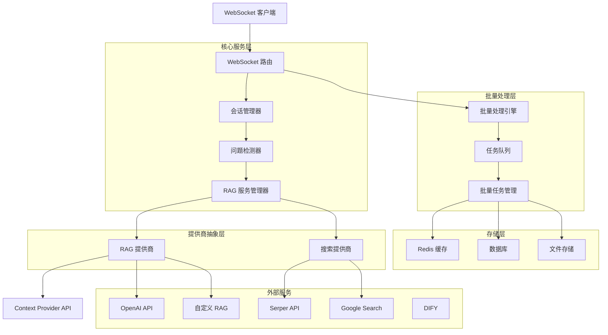

# 技术实现计划

## 架构设计

### 系统架构概览



### 模块边界

#### 1. WebSocket 路由层 (`app/routers/`)
- **职责**: 处理 WebSocket 连接生命周期和消息路由
- **边界**: 接收客户端消息，调用业务逻辑，返回响应
- **依赖**: 会话管理器、RAG 服务管理器

#### 2. 会话管理层 (`app/models/`)
- **职责**: 管理用户会话状态和 ASR 文本累积
- **边界**: 维护会话状态，提供问题检测接口
- **依赖**: 无外部依赖

#### 3. RAG 服务管理层 (`app/services/`)
- **职责**: 统一管理 RAG 和搜索服务提供商
- **边界**: 提供统一的查询接口，隐藏提供商差异
- **依赖**: 提供商抽象层

#### 4. 提供商抽象层 (`app/services/rag_providers/`)
- **职责**: 实现具体的服务提供商接口
- **边界**: 封装第三方 API 调用，标准化结果格式
- **依赖**: 外部服务 API

#### 5. 批量处理层 (`app/services/batch_processor.py`)
- **职责**: 处理离线批量任务，管理任务队列
- **边界**: 接收批量任务，调度执行，返回结果
- **依赖**: 任务队列、存储层、RAG服务

#### 6. 任务队列层 (`app/services/task_queue.py`)
- **职责**: 管理任务队列，处理任务调度
- **边界**: 任务入队、出队、状态管理
- **依赖**: Redis、数据库

#### 7. 配置管理层 (`app/config.py`)
- **职责**: 管理应用配置和环境变量
- **边界**: 提供配置访问接口，验证配置有效性
- **依赖**: 无外部依赖

## 数据模型

### 核心数据实体

#### 1. SessionState (会话状态)
```python
class SessionState:
    session_id: str                    # 会话唯一标识
    final_chunks: List[str]           # 最终化 ASR 文本块
    is_paused: bool                   # 是否暂停
    last_final_text: Optional[str]    # 最后一个最终化文本
    current_query_task: Optional[Task] # 当前查询任务
```

#### 2. QueryResult (查询结果)
```python
@dataclass
class QueryResult:
    content: str                      # 主要回答内容
    metadata: Optional[Dict[str, Any]] # 元数据
    sources: Optional[List[Dict]]     # 来源信息
    usage: Optional[Dict[str, Any]]   # 使用统计
```

#### 3. BatchTask (批量处理任务)
```python
class BatchTask:
    task_id: str                      # 任务唯一标识
    name: str                         # 任务名称
    texts: List[str]                  # 待处理文本列表
    options: Dict[str, Any]           # 处理选项
    status: str                       # 任务状态
    progress: float                   # 进度百分比
    results: List[QueryResult]        # 处理结果
    created_at: datetime              # 创建时间
    started_at: Optional[datetime]    # 开始时间
    completed_at: Optional[datetime]  # 完成时间
    error_message: Optional[str]      # 错误信息
```

#### 4. WebSocket 消息格式
```json
{
  "type": "message_type",             # 消息类型
  "session_id": "session_id",         # 会话标识
  "payload": {                        # 消息载荷
    "text": "content",                # 文本内容
    "is_final": boolean,              # 是否最终化
    "action": "control_action"        # 控制动作
  }
}
```

## API 契约

### WebSocket API

#### 连接端点
- **URL**: `ws://host/ws/realtime-asr`
- **协议**: WebSocket (JSON 消息)
- **认证**: 传输层认证（可选）

#### 消息类型

##### 客户端消息
```json
// ASR 文本块
{
  "type": "asr_chunk",
  "text": "语音识别文本",
  "is_final": true,
  "session_id": "optional_session_id"
}

// 控制消息
{
  "type": "control",
  "action": "pause|resume|stop|instant_query",
  "session_id": "optional_session_id"
}

// 心跳消息
{
  "type": "keepalive",
  "session_id": "optional_session_id"
}
```

##### 服务器消息
```json
// 确认消息
{
  "type": "ack",
  "message": "connected",
  "session_id": "generated_session_id"
}

// 状态消息
{
  "type": "status",
  "stage": "listening|paused|analyzing|querying_rag|idle",
  "session_id": "session_id",
  "note": "optional_note"
}

// 答案消息
{
  "type": "answer",
  "stream_index": 0,
  "content": "答案内容块",
  "final": false,
  "session_id": "session_id"
}

// 错误消息
{
  "type": "error",
  "code": "ERROR_CODE",
  "message": "错误描述",
  "session_id": "session_id"
}
```

### REST API

#### 健康检查
- **端点**: `GET /health`
- **响应**:
```json
{
  "status": "healthy",
  "version": "2.0.0",
  "services": {
    "rag": true,
    "search": true,
    "batch_processing": true
  },
  "providers": {
    "rag": {"name": "ContextProvider", "type": "RAG"},
    "search": {"name": "SerperProvider", "type": "Search"}
  }
}
```

#### 批量处理 API
- **提交任务**: `POST /api/batch/tasks`
- **查询状态**: `GET /api/batch/tasks/{task_id}`
- **获取结果**: `GET /api/batch/tasks/{task_id}/results`
- **取消任务**: `DELETE /api/batch/tasks/{task_id}`

## 非功能性需求映射

### 性能需求

#### 响应时间优化
- **异步处理**: 使用 asyncio 实现异步 I/O
- **连接池**: 复用 HTTP 客户端连接
- **缓存策略**: 实现查询结果缓存（可选）

#### 并发处理
- **连接限制**: 实现连接数限制和负载均衡
- **任务队列**: 使用异步任务队列处理高并发查询
- **资源管理**: 合理管理内存和 CPU 资源

#### 可扩展性
- **水平扩展**: 支持多实例部署
- **负载均衡**: 支持会话粘性负载均衡
- **动态扩容**: 支持基于负载的自动扩容

### 安全需求

#### 传输安全
- **TLS 加密**: 强制使用 HTTPS/WSS
- **证书管理**: 支持 SSL 证书自动续期
- **安全头**: 设置适当的安全 HTTP 头

#### 认证授权
- **API 密钥**: 安全的 API 密钥管理
- **访问控制**: 基于 IP 的访问控制
- **会话验证**: WebSocket 连接级别的认证

#### 数据保护
- **敏感信息**: 不存储用户敏感数据
- **日志脱敏**: 日志中脱敏敏感信息
- **数据加密**: 支持敏感数据加密存储

### 可靠性需求

#### 错误处理
- **优雅降级**: 服务不可用时的优雅处理
- **重试机制**: 自动重试失败的请求
- **熔断器**: 防止级联故障

#### 监控告警
- **健康检查**: 定期健康检查
- **指标监控**: 性能指标监控
- **告警机制**: 异常情况自动告警

## 技术栈选择

### 后端技术栈
- **Web 框架**: FastAPI 0.111.0
  - 理由: 高性能、异步支持、自动 API 文档生成
- **WebSocket**: FastAPI WebSocket 支持
  - 理由: 原生异步支持、与 FastAPI 集成良好
- **HTTP 客户端**: httpx 0.27.0
  - 理由: 异步 HTTP 客户端、支持 HTTP/2
- **配置管理**: python-dotenv
  - 理由: 简单易用、环境变量管理
- **任务队列**: Redis + Celery
  - 理由: 高性能、支持分布式任务调度
- **数据库**: PostgreSQL 或 SQLite
  - 理由: 支持复杂查询、数据持久化

### 部署技术栈
- **容器化**: Docker
  - 理由: 标准化部署、环境一致性
- **编排**: Kubernetes (可选)
  - 理由: 容器编排、自动扩缩容
- **反向代理**: Nginx
  - 理由: 高性能、负载均衡、SSL 终止

### 监控技术栈
- **指标收集**: Prometheus
  - 理由: 开源、功能强大、生态丰富
- **可视化**: Grafana
  - 理由: 丰富的图表、灵活的查询
- **日志收集**: ELK Stack (可选)
  - 理由: 集中化日志管理、搜索分析

## 风险与假设

### 技术风险

#### 高风险
1. **WebSocket 连接稳定性**
   - 风险: 网络不稳定导致连接中断
   - 缓解: 实现重连机制、心跳检测
   - 监控: 连接成功率指标

2. **第三方服务可用性**
   - 风险: RAG 服务提供商不可用
   - 缓解: 多提供商支持、降级策略
   - 监控: 服务可用性监控

#### 中风险
1. **高并发性能**
   - 风险: 高并发导致性能下降
   - 缓解: 负载测试、性能优化
   - 监控: 性能指标监控

2. **内存泄漏**
   - 风险: 长时间运行导致内存泄漏
   - 缓解: 定期重启、内存监控
   - 监控: 内存使用指标

### 业务风险

#### 高风险
1. **数据隐私**
   - 风险: 用户数据隐私泄露
   - 缓解: 数据脱敏、访问控制
   - 合规: 遵循数据保护法规

2. **服务成本**
   - 风险: RAG 服务调用成本过高
   - 缓解: 使用限制、成本监控
   - 优化: 缓存策略、查询优化

### 假设条件

1. **网络环境稳定**: 假设网络环境相对稳定，延迟在可接受范围内
2. **服务提供商可靠**: 假设 RAG 服务提供商稳定可用，响应时间可预测
3. **用户行为合理**: 假设用户合理使用服务，不会恶意攻击或滥用
4. **资源充足**: 假设部署环境有足够的计算和存储资源

## 迭代策略

### 第一阶段: 核心功能 (MVP)
- **目标**: 实现基本的 WebSocket 通信和 RAG 查询
- **功能**: WebSocket 连接、ASR 处理、问题检测、多提供商集成
- **时间**: 2-3 周
- **验收**: 基本功能正常工作

### 第二阶段: 批量处理支持
- **目标**: 实现离线批量处理能力
- **功能**: 批量处理引擎、任务队列、进度跟踪
- **时间**: 2-3 周
- **验收**: 批量处理功能正常工作

### 第三阶段: 性能优化
- **目标**: 优化性能和并发处理能力
- **功能**: 异步优化、连接池、缓存策略、批量处理优化
- **时间**: 1-2 周
- **验收**: 性能指标达到要求

### 第四阶段: 监控运维
- **目标**: 完善监控和运维能力
- **功能**: 指标监控、日志管理、告警机制、批量处理监控
- **时间**: 1-2 周
- **验收**: 监控系统正常工作

### 第五阶段: 安全加固
- **目标**: 加强安全性和合规性
- **功能**: 认证授权、数据保护、安全审计、批量处理安全
- **时间**: 1-2 周
- **验收**: 安全测试通过

## 成功指标

### 技术指标
- **功能完整性**: 所有核心功能正常工作
- **性能达标**: 响应时间、并发能力达到要求
- **稳定性**: 错误率 < 0.1%，可用性 > 99.9%
- **可扩展性**: 支持水平扩展和提供商扩展

### 业务指标
- **用户满意度**: 用户对响应速度和准确性满意
- **开发者友好**: API 易用性、文档完整性
- **运维效率**: 部署和维护效率提升
- **成本控制**: 服务成本在预算范围内

### 质量指标
- **代码质量**: 代码覆盖率 > 80%，无严重缺陷
- **文档质量**: 文档完整性、准确性
- **测试质量**: 单元测试、集成测试覆盖率
- **安全质量**: 安全漏洞数量为 0
