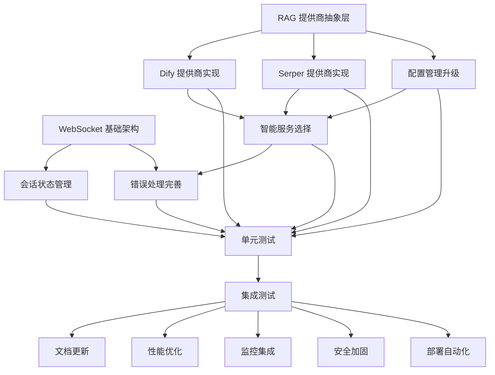

# 任务分解

## 任务概览

| 任务ID | 任务名称 | 优先级 | 状态 | 负责人 | 预估时间 | 依赖关系 |
|--------|----------|--------|------|--------|----------|----------|
| T-001 | WebSocket 基础架构 | P0 | 已完成 | - | 3天 | - |
| T-002 | 会话状态管理 | P0 | 已完成 | - | 2天 | T-001 |
| T-003 | RAG 提供商抽象层 | P0 | 已完成 | - | 4天 | - |
| T-004 | Dify 提供商实现 | P0 | 已完成 | - | 2天 | T-003 |
| T-005 | Serper 提供商实现 | P1 | 已完成 | - | 2天 | T-003 |
| T-006 | 配置管理升级 | P1 | 已完成 | - | 1天 | T-003 |
| T-007 | 智能服务选择 | P1 | 已完成 | - | 1天 | T-003, T-004, T-005 |
| T-008 | 错误处理完善 | P1 | 已完成 | - | 2天 | T-001-T-007 |
| T-009 | 单元测试 | P1 | 已完成 | - | 3天 | T-001-T-008 |
| T-010 | 集成测试 | P1 | 已完成 | - | 2天 | T-009 |
| T-011 | 文档更新 | P2 | 已完成 | - | 2天 | T-001-T-010 |
| T-012 | 性能优化 | P2 | 待开发 | - | 3天 | T-010 |
| T-013 | 监控集成 | P2 | 待开发 | - | 3天 | T-010 |
| T-014 | 安全加固 | P2 | 待开发 | - | 2天 | T-010 |
| T-015 | 部署自动化 | P2 | 待开发 | - | 2天 | T-010 |

## 详细任务描述

### 第一阶段: 核心功能 (已完成)

#### T-001: WebSocket 基础架构
- **描述**: 实现 WebSocket 连接管理和消息路由
- **验收标准**:
  - WebSocket 连接正常建立和断开
  - 消息路由和处理机制工作正常
  - 连接状态跟踪和会话管理
- **测试类型**: 单元测试、集成测试
- **文件**: `app/routers/websocket.py`

#### T-002: 会话状态管理
- **描述**: 实现会话状态管理和 ASR 文本累积
- **验收标准**:
  - 会话状态正确维护和更新
  - ASR 文本块正确累积和聚合
  - 问题检测逻辑工作正常
- **测试类型**: 单元测试
- **文件**: `app/models/session.py`

#### T-003: RAG 提供商抽象层
- **描述**: 设计和实现 RAG 服务提供商抽象接口
- **验收标准**:
  - 基础抽象类定义完整
  - 工厂模式实现正确
  - 统一的结果格式定义
- **测试类型**: 单元测试
- **文件**: `app/services/rag_providers/base.py`

#### T-004: Dify 提供商实现
- **描述**: 实现 Dify RAG 服务提供商
- **验收标准**:
  - Dify API 调用正常工作
  - 错误处理机制完善
  - 配置验证正确
- **测试类型**: 单元测试、集成测试
- **文件**: `app/services/rag_providers/dify.py`

#### T-005: Serper 提供商实现
- **描述**: 实现 Serper 搜索服务提供商
- **验收标准**:
  - Serper API 调用正常工作
  - 搜索结果格式化正确
  - 错误处理机制完善
- **测试类型**: 单元测试、集成测试
- **文件**: `app/services/rag_providers/serper.py`

#### T-006: 配置管理升级
- **描述**: 升级配置管理以支持多提供商
- **验收标准**:
  - 多提供商配置支持
  - 环境变量配置正确
  - 配置验证机制工作
- **测试类型**: 单元测试
- **文件**: `app/config.py`

#### T-007: 智能服务选择
- **描述**: 实现基于关键词的智能服务选择
- **验收标准**:
  - 问题检测逻辑正确
  - 服务选择策略工作
  - 统一查询接口实现
- **测试类型**: 单元测试、集成测试
- **文件**: `app/services/rag_service.py`

#### T-008: 错误处理完善
- **描述**: 完善错误处理和异常管理
- **验收标准**:
  - 所有异常都有适当处理
  - 错误消息用户友好
  - 日志记录完善
- **测试类型**: 单元测试
- **文件**: 所有模块

#### T-009: 单元测试
- **描述**: 编写完整的单元测试套件
- **验收标准**:
  - 代码覆盖率 > 80%
  - 所有核心功能有测试覆盖
  - 测试用例质量高
- **测试类型**: 单元测试
- **文件**: `tests/test_*.py`

#### T-010: 集成测试
- **描述**: 编写集成测试和端到端测试
- **验收标准**:
  - WebSocket 流程测试通过
  - 多提供商切换测试通过
  - 错误场景测试通过
- **测试类型**: 集成测试
- **文件**: `tests/integration_test_*.py`

#### T-011: 文档更新
- **描述**: 更新所有相关文档
- **验收标准**:
  - 架构文档更新完整
  - API 文档准确
  - 扩展指南详细
- **测试类型**: 文档审查
- **文件**: `spec/*.md`

### 第二阶段: 性能优化 (待开发)

#### T-012: 性能优化
- **描述**: 优化系统性能和并发处理能力
- **验收标准**:
  - 响应时间达到要求
  - 并发处理能力达标
  - 资源使用优化
- **测试类型**: 性能测试
- **依赖**: T-010
- **文件**: 所有模块

**子任务**:
- T-012-1: 异步 I/O 优化
- T-012-2: 连接池实现
- T-012-3: 缓存策略实现
- T-012-4: 内存使用优化

### 第三阶段: 监控运维 (待开发)

#### T-013: 监控集成
- **描述**: 集成监控和指标收集
- **验收标准**:
  - Prometheus 指标集成
  - Grafana 仪表板配置
  - 告警机制实现
- **测试类型**: 集成测试
- **依赖**: T-010
- **文件**: `app/monitoring/`

**子任务**:
- T-013-1: Prometheus 指标定义
- T-013-2: 健康检查实现
- T-013-3: 日志收集配置
- T-013-4: 告警规则配置

### 第四阶段: 安全加固 (待开发)

#### T-014: 安全加固
- **描述**: 加强系统安全性和合规性
- **验收标准**:
  - 认证授权机制完善
  - 数据保护措施到位
  - 安全审计日志完整
- **测试类型**: 安全测试
- **依赖**: T-010
- **文件**: `app/security/`

**子任务**:
- T-014-1: WebSocket 认证实现
- T-014-2: API 密钥管理
- T-014-3: 数据加密实现
- T-014-4: 安全审计日志

### 第五阶段: 部署自动化 (待开发)

#### T-015: 部署自动化
- **描述**: 实现自动化部署和 CI/CD 流程
- **验收标准**:
  - Docker 镜像构建
  - Kubernetes 部署配置
  - CI/CD 流程实现
- **测试类型**: 部署测试
- **依赖**: T-010
- **文件**: `deploy/`, `.github/workflows/`

**子任务**:
- T-015-1: Docker 配置
- T-015-2: Kubernetes 配置
- T-015-3: CI/CD 流程
- T-015-4: 环境配置管理

## 任务依赖关系图

## 测试策略

### 测试类型定义

#### 单元测试
- **范围**: 单个函数或类
- **工具**: pytest
- **覆盖率**: > 80%
- **执行频率**: 每次代码提交

#### 集成测试
- **范围**: 模块间交互
- **工具**: pytest + testcontainers
- **覆盖率**: > 70%
- **执行频率**: 每日构建

#### 端到端测试
- **范围**: 完整用户流程
- **工具**: pytest + WebSocket 客户端
- **覆盖率**: > 60%
- **执行频率**: 发布前

#### 性能测试
- **范围**: 性能和并发能力
- **工具**: locust
- **指标**: 响应时间、吞吐量、并发数
- **执行频率**: 每周

#### 安全测试
- **范围**: 安全漏洞和合规性
- **工具**: bandit, safety
- **指标**: 安全漏洞数量
- **执行频率**: 每次发布

### 测试环境

#### 开发环境
- **用途**: 开发人员本地测试
- **配置**: 最小化配置
- **数据**: 模拟数据
- **部署**: Docker Compose

#### 测试环境
- **用途**: 自动化测试
- **配置**: 接近生产环境
- **数据**: 测试数据集
- **部署**: Kubernetes

#### 预生产环境
- **用途**: 发布前验证
- **配置**: 生产环境配置
- **数据**: 生产数据副本
- **部署**: 生产环境镜像

## 质量保证

### 代码质量

#### 静态分析
- **工具**: flake8, black, mypy
- **标准**: PEP 8, 类型注解
- **执行**: 每次代码提交

#### 代码审查
- **流程**: Pull Request 审查
- **标准**: 功能正确性、代码质量、测试覆盖
- **要求**: 至少一人审查

#### 技术债务
- **跟踪**: GitHub Issues
- **优先级**: 基于影响和成本
- **解决**: 定期技术债务清理

### 文档质量

#### 代码文档
- **标准**: Google 风格 docstring
- **覆盖率**: 所有公共 API
- **更新**: 代码变更时同步更新

#### API 文档
- **工具**: FastAPI 自动生成
- **格式**: OpenAPI 3.0
- **更新**: API 变更时自动更新

#### 用户文档
- **格式**: Markdown
- **维护**: 专人负责
- **更新**: 功能变更时更新

### 发布质量

#### 版本管理
- **策略**: 语义化版本控制
- **标签**: Git 标签
- **变更日志**: CHANGELOG.md

#### 发布流程
- **测试**: 所有测试通过
- **文档**: 文档更新完整
- **部署**: 自动化部署
- **验证**: 发布后验证

#### 回滚策略
- **触发**: 严重问题
- **方式**: 快速回滚到上一版本
- **时间**: < 5 分钟
- **验证**: 回滚后功能验证
